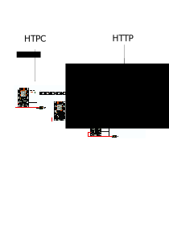

# SoundLights v0.9

Ledstrip Audio Visualiser for CoreElec using ESP8266. This is a working release, although things can be improved. Soe effects from the original work of Wirekraken have not been migrated yet. Also the HTML page to control the LED strip is not great.

## Features

1. Visualise audio on a LED scripts. The LED strips works as an equalizer with some logic to add a strobe effect.
2. LED effects like fire and rainbow
3. Broadasts audio data over UDP, so multiple strips can recieve audio data simultaniously
4. Controllable over HTTP and JSON interface

## Architecture overview

The python module and CAVA run on the HTPC, broadcasting audio data over Wifi to 1 or more LED strips. CAVA can use both Pulseaudio and ALSA as audio source. From a browser or using HTTP post calls you can control each individual LED strip.



ESP/LEDstrip Image by wireKraken https://github.com/wirekraken/ESP8266-Websockets-LED 

## Dependencies / Credits

The following requirements apply to use the software

1. LED strip supported by FastLED. I tested using a NEOPIXEL 144 LED strip
2. ESP8266 board with Wifi, compatible with Arduino ESP
3. A AMD64 or ARM64 machine that can run the pyhton and CAVA modules

### Overall

Based on https://github.com/nvbn/soundlights, uses the broadcast logic to broadcast audio information onto the network

Uses CAVA https://github.com/karlstav/cava to convert audio into a data stream. In the releases is a CAVA build included compiled against CoreElec and one compiled against  Linux Mint 20.1 64-bit. Pulse audio and ALSA are supported in the build

CoreElec 19.3 https://coreelec.org/ / KODI https://kodi.tv/ compatible, so you can connect the LED strip to your HTPC. Although LibreElec compiled for AMLogic also should work.

### Python module

Requires Python3 https://www.python.org/ (already included on Mint and Coreelec

### ESP module

Based on the great work of Wirekraken https://github.com/wirekraken/ESP8266-Websockets-LED Basically I have forked his work and rewrittten a  big part of the code to be more modular and object oriented. Also I have extended the code with UDP support and a configuration module.

Requires Arduino https://www.arduino.cc/ to compile the ESP8266 application. 

Requires ESP8266WebServer https://github.com/esp8266/Arduino/tree/master/libraries/ESP8266WebServer to provide a simple web interface to control the LED strip

Requires FastLED https://github.com/FastLED/FastLED 3.4 to control the LED strip


## Compiling and installation

### ESP module

1. Change the WIFI parameters (ssid, password and IP) in soundlights.ino to match your network. 
2. In LEDStrip.h change LED_COUNT to the number of LEDs in your strip. And change LED_DT to the i/o pin number on which the LED strip is attached
3. Compile and upload the software to the ESP module
4. Upload the HTML and CSS files from the data directory using 'Sketch data upload' in the Aruino Tools menu.

### CAVA

In the release a precompiled CAVA version for AMD64 and CoreElec Amogic-ng build is avaiable. But if you manually want to compile CAVA you can follow these steps

#### For AMD64

Download CAVA https://github.com/karlstav/cava and the dependencies, following the instruction to build CAVA.

#### For CoreELec

Download and compile Coreelec 19.3 from https://github.com/CoreELEC/CoreELEC/tree/coreelec-19

Download CAVA https://github.com/karlstav/cava and the dependencies

Compile CAVA against the CoreELEC build
```
export CPPGLAGS="-I<CoreELEC path>/build.CoreELEC-Amlogic-ng.arm-19/toolchain/lib" 
export LD_LIBRARY_PATH=$LD_LIBRARY_PATH:/usr/aarch64-linux-gnu/lib/
export LD_LIBRARY_PATH=$LD_LIBRARY_PATH:/<CoreELEC path>/build.CoreELEC-Amlogic-ng.arm-19/toolchain/lib
export CC=<CoreELEC path>/build.CoreELEC-Amlogic-ng.arm-19/toolchain/bin/armv8a-libreelec-linux-gnueabihf-gcc
OST_OS=linux ./configure --target=aarch64  --disable-output-ncurses --host=amd64 --disable-input-portaudio  --disable-input-sndio --disable-output-sdl  
```

### Installing CAVA

These instructions apply to CoreELEC with Kodi, but can be adapted to any Linux installation 

1. Create a directory /storage/soundlights and place here cava, cava_config,kodileds.sh and client.py from the release. 
2. Adjust in cava_config the line bars = 144, replacing 144 with the number of LEDs in your strip. 
3. To the same for the line NUM_BARS=144 in client.py
4. Create a file /storage/.config/autostart.sh with

```
#!/bin/sh 
pactl load-module module-udev-detect
pactl load-module module-null-sink sink_name=recsink
pactl load-module module-alsa-sink device=hw:0,0
pactl load-module module-loopback source=recsink.monitor sink=alsa_output.0.hdmi-stereo
```

This may need ajusting depending on your exact hardware.

Run nohup /storage/soundlights/kodileds.sh & to start the module

Make sure to change the Kodi settings to use the pulseaudio device

.


